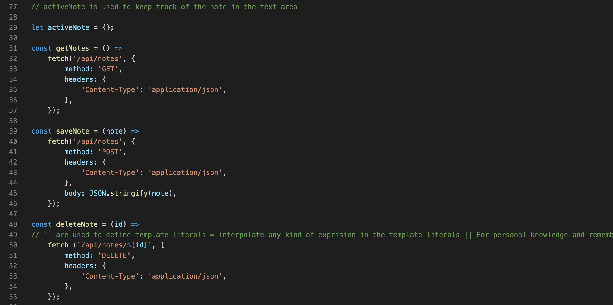
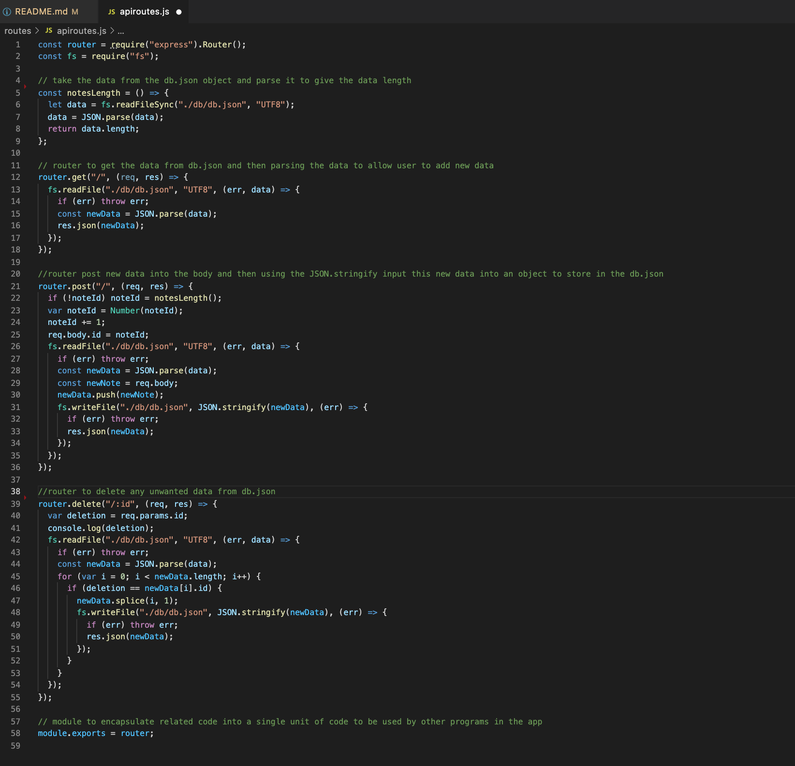
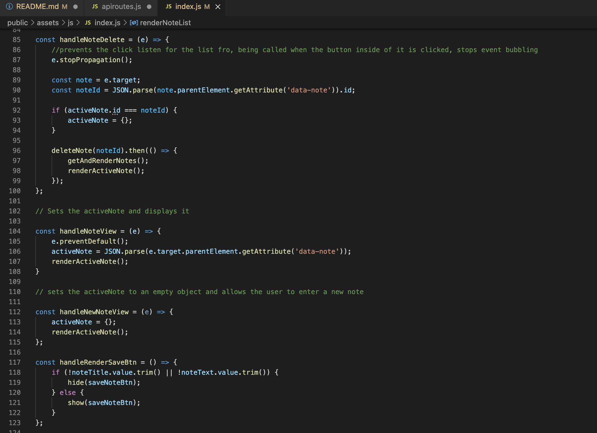
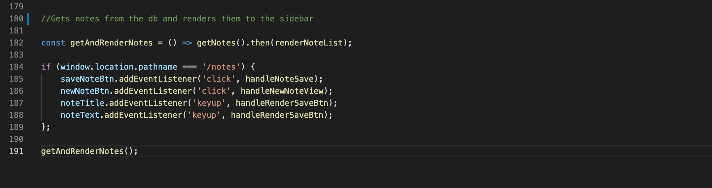

# take_my_notes

## Description

This is an app created using the Express.js backend and is deployed on the Heroku environment

The main reason to create this app was to help a smll business owner create and manage small notes as task manager. This will allow the user to create, save and delete notes

# Heroku App

[Heroku](https://take-notes-for-me.herokuapp.com/)

## Tabel of Contents

* [Installation](#installation)
* [Usage](#usage)
* [Contribute](#contribute)
* [Tests](#tests)
* [Screenshots](#screenshots)
* [Technology](#technology)
* [Making](#making)
* [Questions](#questions)

## Installation

In order to run this application, you will need to install the following

- npm instal node.js
- npm install express.js

## Usage

In order to use this app, you will need to understand the following;

- HTML
- Node
- Javascript
- Heroku

## Contribute

In order to contribute to this app, you will need to understand the following;

- HTML
- Node
- Javascript
- Heroku

## Tests

To run tests, please use the following command:

- npm run test

## Screenshots of deployed app

## Technology

- Github
- HTML
- CSS - Bootstrap
- Javascript
- Node.js
- Express.js
- Heroku

## Making

These are the screenshots of the code 

API routes in public index.js

API routes in apiroutes.js

Displays the note from db.json

Saves the note to the sidebar

## Questions

Please click the links below

[Github] (https://github.com/kishan254)

Write me on;

[Email] (kishan.gosrani@hotmail.com)

## License

This project is currently licensed under the MIT [License](https://choosealicense.com/licenses/mit/)